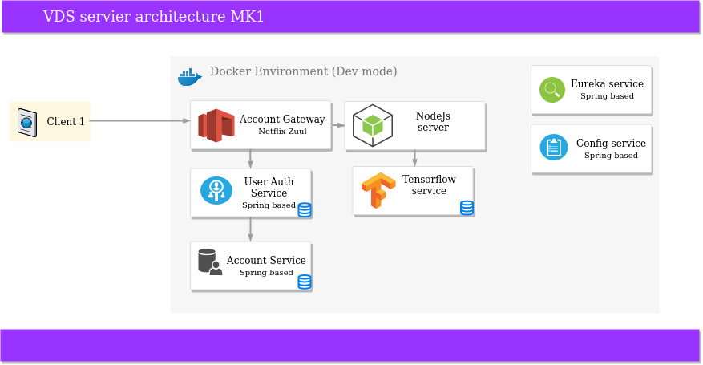

# VDS initiative

Virtual design studio concept has a focus to solve next questions:
1) select suitable design for certain room in flat/house   
2) define cost/price for each component on generated design

Trello board: https://trello.com/b/v7yL7thG/vds-initiative

## Description
Current server's concept approximately looks: 

## Technical Stack
not yet ready

## How To Run
Not yet ready

## Testing
Not yet ready

## License
MIT